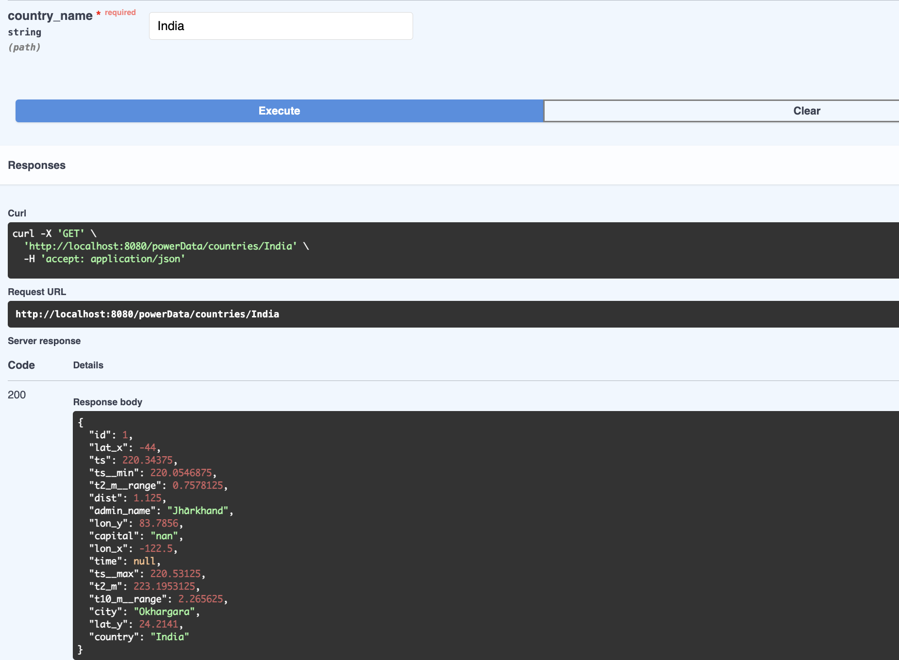

## Technology Stack

This project uses **FastAPI** for building the API, which allows for high performance and easy development. FastAPI is designed to create APIs quickly with minimal code while ensuring high performance, making it a great choice for this project.

## Architecture

The application follows a **three-tier architecture**, which separates the application into three layers:

1. **Presentation Layer**: This is the user interface where users interact with the API.
2. **Business Logic Layer**: This layer contains the core functionality and logic of the application.
3. **Data Access Layer**: This layer handles the interaction with the database or external data sources.

This architecture promotes separation of concerns, making the application easier to maintain and scale.

## Installation

To install the dependencies, navigate to the project directory and use Poetry:

```bash
cd gd-nasa-api
poetry install
```

## Runing the API
To run the API, execute the following command:

```bash
poetry run api
```

## Testing the API
Once the API is running, you can test it by visiting:

```bash
http://localhost:8080/docs
```
You can test the API using either a city name or a country name.

Output Example
This is a picture of the output:




## Conclusion

This project demonstrates how to effectively use NASA's Open Data Power through a FastAPI application structured with a three-tier architecture. We encourage contributions and feedback to improve the project further.

Read all the article on medium: [Build Data Product with FastAPI](https://medium.com/gnomondigital/part-3-4-build-data-product-with-fastapi-feb380a6a42c)
## Connect with Us

- [LinkedIn](https://www.linkedin.com/company/gnomon-digital)
- [Medium](https://medium.com/gnomondigital)
- [Official Website](https://www.gnomondigital.com)